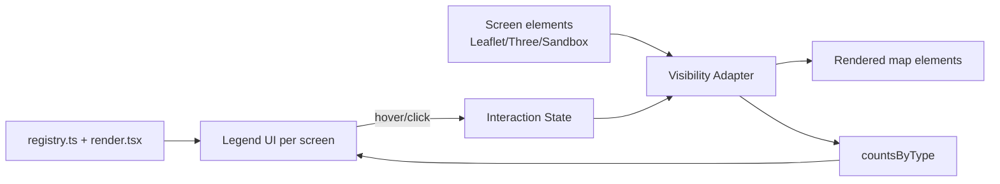

# Map legend — Phase 2 (interactive) plan

Этот документ — план второй фазы. MVP уже завершён: легенды во всех картах рендерятся из единого реестра.

- Реестр: [src/lib/networkLegend/registry.ts](../src/lib/networkLegend/registry.ts)
- Render-helpers: [src/lib/networkLegend/render.tsx](../src/lib/networkLegend/render.tsx)
- Консьюмеры: [ProposalLegend](../src/components/networks/ProposalLegend.tsx), [EarthScene](../src/components/EarthScene.tsx) (`GlobeLegendBody`), [/sandbox](../src/app/sandbox/page.tsx).

## Цели Phase 2

1. Hover по строке легенды подсвечивает соответствующие элементы на карте.
2. Клик переключает фильтр (показывать только выбранные типы).
3. Per-type счётчики количества элементов в текущем viewport.

## Архитектура

Состояние держим **локально в контейнере экрана** (без глобального стора):
- `hoveredType: string | null`
- `activeTypes: Set<string> | null` (`null` — фильтр не активен)
- `countsByType: Record<string, number>`

## Файлы и зоны ответственности

- `registry.ts` — добавить alias-маппинг (например, `SATELLITE_BACKHAUL` → набор element-types).
- `render.tsx` — расширить API строк (`hovered`, `active`, `muted`, `count`, обработчики).
- `ProposalLegend.tsx` — стать controlled (получать состояние и колбэки).
- `MapView.tsx` — применять фильтр/подсветку на уровне overlay-кэша; считать viewport-counts.
- `EarthScene.tsx` — мутация materials/visibility у объектов в `globeNetworkElementsGroup` (`userData.elType`); счётчики из загруженного dataset.
- `sandbox/page.tsx` — фильтр/подсветка только как visibility, не ломая placement/cable flow.

## Применимость по экранам

- Leaflet 2D — все три фичи штатно (visibility/style на оверлеях, viewport bounds для counts).
- Three.js глобус — hover/filter через материалы/visibility, **без перестроения геометрии**; counts по загруженным данным.
- Sandbox — фильтр как vis-aid, не вмешивается в `selectedType` и cable-from.

## Риски и митигации

- Heavy hover work на глобусе → throttle через `requestAnimationFrame`, мутировать готовые материалы.
- React-rerender storm → транзитивный hover в `ref`, мемоизация строк, локальные адаптеры.
- Leaflet overlay churn → per-element cache, переключаем style/visibility on-place.
- Конфликт интерактивов в sandbox → приоритет: editing > legend filter > hover.
- Семантика логических связей (`SATELLITE_BACKHAUL`) → alias в registry.

## Поэтапный rollout

Под фиче-флагом `NEXT_PUBLIC_LEGEND_INTERACTIVE_V2`:

1. Foundation: API строк + controlled-контракт легенд.
2. Filter-only (Leaflet + globe) + reset.
3. Hover highlight (сначала Leaflet, потом optimized globe path).
4. Counters: viewport на Leaflet, dataset на globe, total на sandbox.
5. Интеграция в sandbox последней — после регресс-проверки edit flow.
6. После validation — flag on by default.

## Критерии приёмки

- Hover в легенде → подсветка только нужных типов на активном экране.
- Click в легенде → multi-select фильтр; «сброс» возвращает всё.
- Counters обновляются при пане/зуме/обновлении данных.
- Без заметных провалов FPS на глобусе.
- Existing tooltip/hover cards и существующая визуальная легенда не регрессируют.
